<div align="center">
  <a href="https://yuki-tech.vercel.app/en">
    
  </a>

  <h1>Dayron Anjos</h1>

  <p>
    <strong>Full-Stack Engineer with an Infrastructure Mindset</strong>
  </p>

  <p>
    Backend · Automation · Linux · Networks
  </p>

  

  <p>
    <em>Born to code. Destined to make history.</em>
  </p>

  <p>
    Software Engineering student building full-stack products,
    backend systems and operational automation.
  </p>

  <br />

  <a href="https://yuki-tech.vercel.app/en">
    
  </a>

  <a href="https://www.linkedin.com/in/dayron-anjos-566b02323/">
    
  </a>

  <a href="mailto:dayronjp17@gmail.com">
    
  </a>
</div>

---

## `$ whoami`

```bash
dayron@yuki-tech:~$ whoami

Name        : Dayron Anjos
Alias       : Yuki
Role        : Full-Stack Engineer
Focus       : Backend, automation and infrastructure-aware software
Education   : Software Engineering — in progress
Background  : Systems development, IT support and network infrastructure
Location    : São Paulo, Brazil
```

I am a full-stack developer with a strong backend and infrastructure focus, working mainly with **TypeScript, JavaScript, Python and PHP**.

My professional background in technical support and network infrastructure keeps my development work grounded in real operational challenges.

Alongside software development, I work with Linux, networks, firewalls, VPNs, switching, access control, monitoring and troubleshooting.

This experience shapes the way I build software: considering not only the interface and application code, but also security, reliability, automation and production operations.

```text
User Interface
      ↓
Application Logic
      ↓
APIs and Databases
      ↓
Authentication and Security
      ↓
Linux, Networks and Production Operations
```

---

## `./engineering-profile`

<table>
  <tr>
    <td width="33%" valign="top">

### Product Engineering

Frontend, backend, APIs and relational databases working together as one maintainable product.

</td>
    <td width="33%" valign="top">

### Automation

Tools and scripts that reduce repetitive work, standardize processes and improve operational consistency.

</td>
    <td width="33%" valign="top">

### Infrastructure

Linux, networks, firewalls, VPNs and monitoring as context for better software decisions.

</td>
  </tr>
</table>

---

## `./selected-work`

### KotoNexus

A private and authenticated knowledge platform that connects Japanese studies, university notes, schedules and JLPT preparation in one system.

I am responsible for its product design, full-stack architecture and implementation.

```yaml
project: KotoNexus
type: Full-stack personal product

stack:
  - Next.js 16
  - React 19
  - TypeScript
  - Tailwind CSS 4
  - Auth.js
  - Neon PostgreSQL
  - Drizzle ORM
  - Zustand
  - SWR
  - D3.js
  - Framer Motion
  - Vercel

engineering:
  - authentication and authorization
  - relational data modeling
  - server-side development
  - interactive data visualization
  - progress tracking
  - responsive interfaces
  - installable PWA
  - multilingual user experience
```

The platform includes vocabulary management, study planning, university notes, progress visualization, knowledge organization and JLPT-focused assessment flows.

---

### Corenet Services

A public corporate website that transforms security and connectivity services into a clear, responsive and professional digital experience.

```yaml
project: Corenet Services
type: Corporate website

stack:
  - Astro
  - Tailwind CSS
  - JavaScript
  - Framer Motion

responsibilities:
  - information architecture
  - responsive frontend development
  - interface implementation
  - technical communication
  - visual hierarchy
  - performance optimization
```

The project focuses on presenting technical services clearly without overwhelming users with unnecessary complexity.

---

### Network Infrastructure Automation

Python-based tooling for recurring network and firewall workflows, including inventory, validation, bulk operations, configuration assistance and data processing.

```text
Python · REST APIs · Bash · Linux · Fortinet · Network Automation
```

These tools are designed to reduce manual inspection, accelerate technical analysis and make recurring operational processes more reliable.

---

### Configuration Template Platform

An internal web platform for generating standardized infrastructure configurations from structured user input.

```text
PHP · CodeIgniter 4 · Twig · Smarty · JavaScript · MySQL
```

The platform centralizes configuration templates, validates user input and reduces avoidable errors in repetitive deployment workflows.

---

### Service KPI and Decision Support

Internal systems that transform service-management data into structured reports and response- and resolution-oriented indicators.

```text
PHP · SQL · Data Modeling · Data Transformation · Reporting
```

These systems convert operational records into structured information that supports both technical and management decisions.

---

### Private Operational Tooling

Some of my professional work involves internal systems and sensitive infrastructure.

These projects are presented through their engineering decisions, technologies and qualitative outcomes without exposing customers, environments or proprietary implementation details.

---

## `./stack --verbose`

### Full-Stack Development

<p>
  
  
  
  
  
  
  
  
</p>

```text
Next.js · React · Astro · TypeScript · JavaScript
HTML · CSS · Tailwind CSS · Framer Motion
Responsive Design · Accessibility · API Integration
```

### Backend and Data

<p>
  
  
  
  
  
</p>

```text
Node.js · Python · PHP 8 · REST APIs
PostgreSQL · MySQL · Neon · Drizzle ORM
Relational Modeling · Authentication · Data Transformation
```

### Application State and Visualization

```text
Zustand · SWR · D3.js · Framer Motion
```

### Systems and Infrastructure

<p>
  
  
  
  
  
</p>

```text
Linux · Bash · Git · GitHub · Vercel
Network Automation · Fortinet · Firewall Policies
VPN · Switching · Monitoring · Troubleshooting
```

### Engineering Practices

```text
Maintainable Code       Clear Architecture
Type Safety             Technical Documentation
Security by Design      Observability
Automated Testing       Production-Oriented Development
```

---

## `cat principles.md`

### 01. Security by Design

Access control, sensitive data, external exposure and failure scenarios should be considered from the beginning — not added after the application is already finished.

### 02. Maintainability Over Cleverness

Readable code, clear responsibilities and thoughtful architecture are more valuable than unnecessary abstractions or clever one-liners.

### 03. Build for Reality

Software must deal with failures, unexpected input, changing requirements and real users.

A working demonstration is only the beginning.

### 04. Automate Repetition

Repeated manual work is often a sign that a script, tool or system should exist.

Automation gives people more time to solve problems that actually require human reasoning.

### 05. Build for Operations

A feature is not truly finished when it only works locally.

It must also be understandable, observable, secure and maintainable in production.

---

## `git log --oneline journey`

```text
04  Software Engineering and Full-Stack Products
    Maintainable applications, APIs, databases, frontend UX
    and production-oriented engineering practices.

03  Automation and Internal Tools
    Scripts and systems developed to improve recurring
    operational workflows.

02  IT Support and Infrastructure
    Linux, connectivity, access control, networking
    and hands-on work in Fortinet environments.

01  Systems Development
    Technical foundations in programming,
    web development and relational databases.
```

Infrastructure was not a detour from software engineering.

It became the operational context behind the software I build.

---

## `./education`

### Academic Background

- **Bachelor’s Degree in Software Engineering** — in progress
- **Technical Program in Systems Development** — completed

### Certifications and Courses

- Fortinet Certified Fundamentals — FCF
- Fortinet Certified Associate — FCA
- LFS101: Introduction to Linux — The Linux Foundation
- Java Development — FIAP
- Relational Database Modeling
- Data Modeling
- Continuous Integration and Continuous Delivery
- Git and GitHub
- Python for Network Engineers
- PHP 8
- JavaScript

---

## `./languages`

```text
Portuguese  Native
English     Intermediate
Japanese    Intermediate · JLPT N4 Certified
```

I am currently studying Japanese at the JLPT N3 level.

---

## `./current-focus`

```yaml
current_focus:
  - backend systems
  - modern React and Next.js
  - TypeScript
  - Python automation
  - REST APIs
  - relational databases
  - Linux
  - infrastructure-aware software

currently_building:
  - production-oriented full-stack applications
  - operational automation tools
  - maintainable backend systems
  - public technical projects
```

---

## `./github-analytics`

<div align="center">
  
</div>

<br />

<div align="center">
  
</div>

<br />

<div align="center">
  
</div>

---

## `./connect`

<div align="center">
  <a href="https://yuki-tech.vercel.app/en">
    
  </a>

  <a href="https://www.linkedin.com/in/dayron-anjos-566b02323/">
    
  </a>

  <a href="mailto:dayronjp17@gmail.com">
    
  </a>

  <a href="https://github.com/dayronjp">
    
  </a>
</div>

---

<div align="center">

```c
while (alive) {
    learn();
    build();
    improve();
}
```

### Born to code. Destined to make history.

<sub>Software shaped by real operations.</sub>

</div>